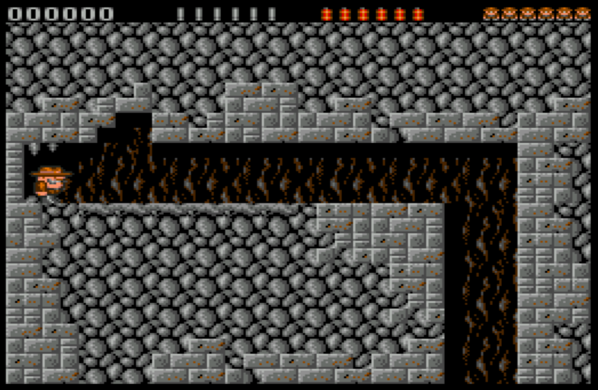
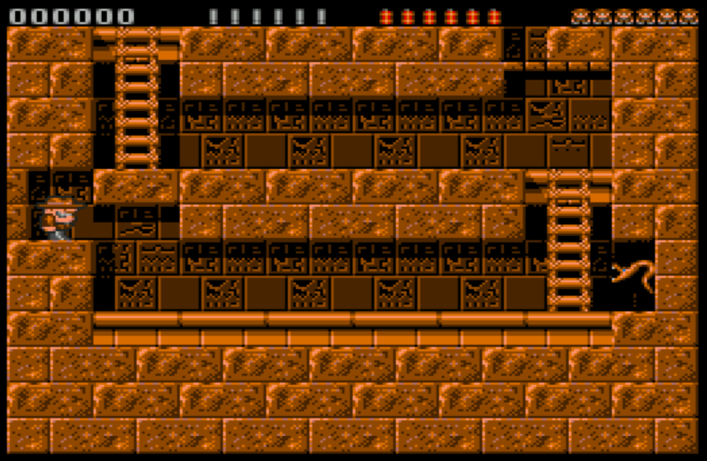
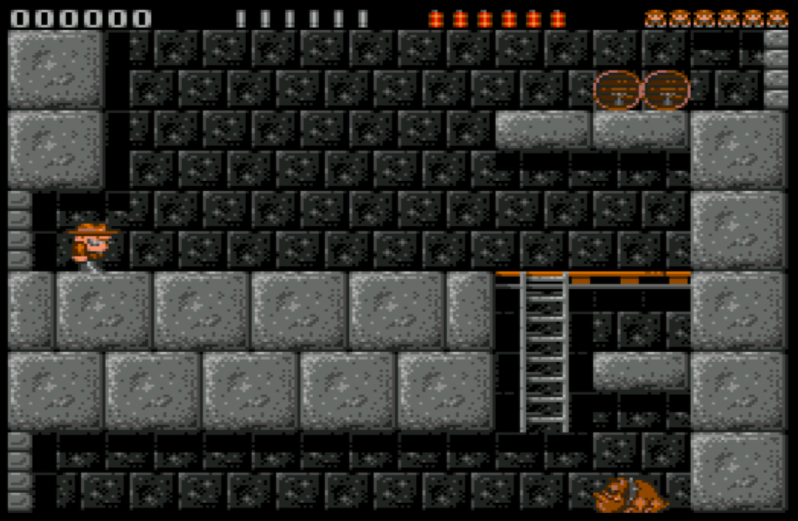
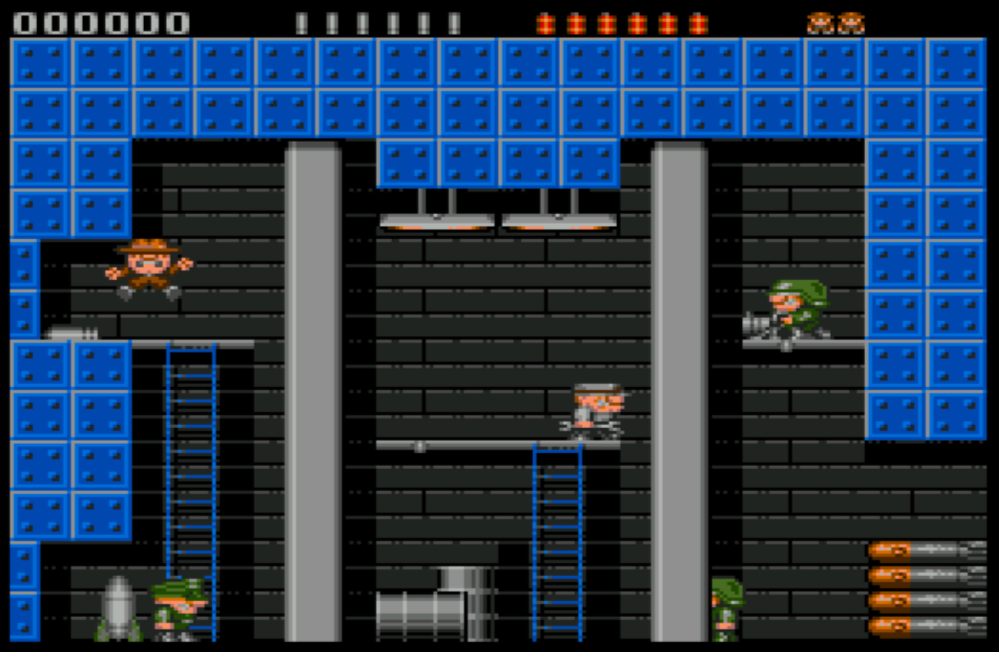

# XRick_Wii

XRick is a reimplementation of classic Rick Dangerous game by BigOrno (bigorno@bigorno.net, http://www.bigorno.net/xrick)
Nintendo Wii port: Bomblik

Rick Dangerous is a platform game developed by Core Design for the Acorn Archimedes, Amiga, 
Atari ST, Amstrad CPC, ZX Spectrum, Commodore 64, and MS-DOS. The game was released in 1989 
and published by MicroProse on the Firebird Software label in the UK, and on the MicroPlay 
label in America. It was also published in Spain by Erbe Software. Later, it was released with 
two other games, Stunt Car Racer and MicroProse Soccer, on the Commodore 64 Powerplay 64 cartridge. 
The game was followed by a sequel, Rick Dangerous 2, in 1990. Loosely based on the Indiana Jones 
film franchise, the game received mixed reviews from critics. 

https://en.wikipedia.org/wiki/Rick_Dangerous

This port is based on XRick release #021212

## Game screenshots

Screenshots of different game worlds

  
  
  
  

## Binary installation

https://github.com/bomblik/xrick_wii/releases

Copy xrick_021212_wii directory to Nintendo Wii device
(to 'apps' subdirectory on SD card or USB drive).

## Source installation

### Compilation

In order to compile XRick_Wii, please install devkitpro toolchain
and set up development environment.

To compile project invoke

    make -f Makefile.wii

To prepare data for installation invoke

    make -f Makefile.wii release

That would create all required data in xrick_021212_wii directory

### Installation

Copy xrick_021212_wii directory to Nintendo Wii device
(to 'apps' subdirectory on SD card or USB drive).

## Key mappings

    Use Wii Remote horizontally

    'left / up / right / down'                : "DPAD"
    'fire'                                    : "2"
    'fire bullet'                             : "2 + UP"
    'lay dynamite'                            : "2 + DOWN"
    'poke with stick'                         : "2 + (LEFT / RIGHT)"
    'exit'                                    : "HOME"
    'cycle through worlds'                    : "B"
    'toggle unlimited: lives, bombs, bullets' : "MINUS"
    'toggle: no collision'                    : "PLUS"

